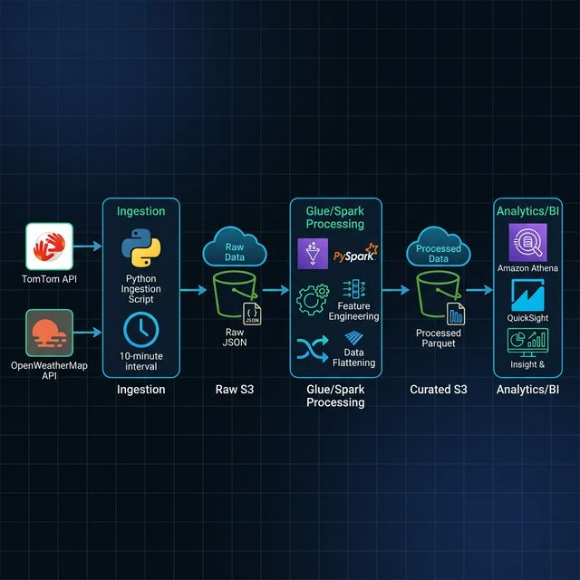

# Traffic and Weather Data Ingestion System

A modular and automated data ingestion system for real-time traffic and weather data, designed for Data Engineering pipelines.

## Architecture



## Features

- **Automated Ingestion**: Unified script that fetches data every 10 minutes.
- **Traffic Data**: Real-time traffic flow data from [TomTom Traffic API](https://developer.tomtom.com/).
- **Weather Data**: Current weather data from [OpenWeatherMap API](https://openweathermap.org/api).
- **Security**: API keys are managed via environment variables to prevent accidental exposure.
- **Robustness**: Independent error handling for each API service.

## Project Structure

```text
traffic-project/
├── src/                  # Source code for data processing
│   ├── jobs/             # Spark transformation jobs (Traffic & Weather)
│   ├── utils/            # Shared utilities (Spark session, etc.)
│   └── schemas/          # Data schemas (Traffic & Weather)
├── ingestion/            # API Ingestion logic
│   ├── ingestion.py      # Unified ingestion script
│   ├── traffic_api.py    
│   └── weather_api.py    
├── data/
│   └── raw/              # Locally stored JSON data
├── docs/                 # Documentation and Diagrams
│   └── architecture_diagram.png
├── configs/              # Configuration files
├── .env                  
├── .gitignore            
├── README.md             
└── requirements.txt      
```

## Setup Instructions

### 1. Clone the repository
```bash
git clone <your-repo-url>
cd traffic-project
```

### 2. Install Dependencies
```bash
pip install -r requirements.txt
```

### 3. Configure API Keys
Create a `.env` file in the root directory and add your API keys:
```text
TOMTOM_API_KEY=your_tomtom_key
WEATHER_API_KEY=your_weather_key
```

## Usage

Run the unified ingestion script to start the automation:
```bash
python ingestion/ingestion.py
```

### Data Transformation (Spark)

To process the raw JSON data from S3 and flatten it into Parquet format:

```bash
export PYTHONPATH=$PYTHONPATH:.
python src/jobs/traffic_transformation.py \
    --input "s3://traffic-data-project-manish/raw/2026/03/23/traffic_20260322_225531.json" \
    --output "s3://traffic-data-project-manish/processed/traffic_flattened/"
```

*Note: Ensure you have `pyspark` installed and AWS credentials configured.*
